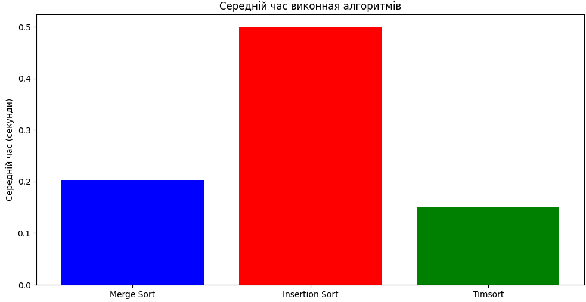
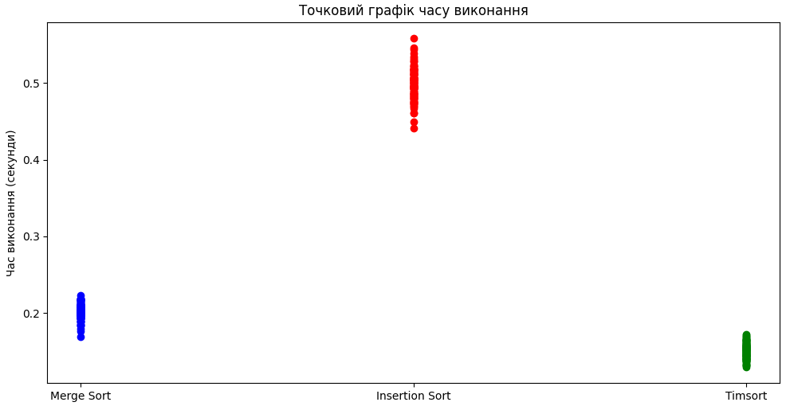
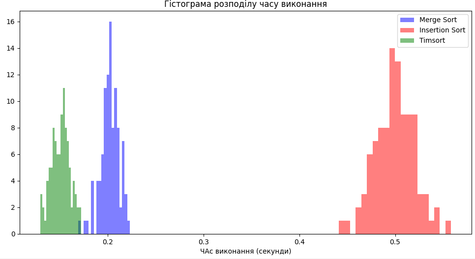

# Аналіз ефективності алгоритмів сортування

## Вступ
Цей документ містить порівняльний аналіз трьох алгоритмів сортування: сортування злиттям (Merge Sort), сортування вставками (Insertion Sort) та Timsort. Аналіз проведено на основі замірів часу виконання кожного алгоритму при сортуванні масивів випадкових чисел.

## Методологія
Для тестування використано масиви випадкових чисел фіксованої довжини. Кожен алгоритм виконувався 100 разів, а час його виконання замірявся для кожної спроби. Дані візуалізовано за допомогою графіків: гістограми середніх значень, точкових діаграм та гістограм розподілу часів.

## Результати
### Гістограма середніх значень
Середній час виконання алгоритмів показав, що Timsort має найкращу середню продуктивність, а сортування вставками — найгіршу.

### Точковий графік
Точковий графік виявив варіативність у часах виконання для сортування Timsort, в той час як Insertion Sort демонстрував більш стабільні результати.

### Гістограма розподілу
Гістограма розподілу показує, що Timsort має більш  широкий розподіл часів, що свідчить про його меншу передбачуваність, але все ж більшу ефективність. Сортування злиттям і вставками мають вужчі розподіли, що вказує на меншу ефективність у їхніх часах виконання.

## Висновки
На основі проведеного аналізу можна зробити висновок, що Timsort є найефективнішим алгоритмом для сортування масивів випадкових чисел у даному тестовому середовищі. Його  швидкість роблять його відмінним вибором для використання в реальних застосуваннях. Сортування вставками ж показало себе менш ефективним у порівнянні з іншими алгоритмами.
